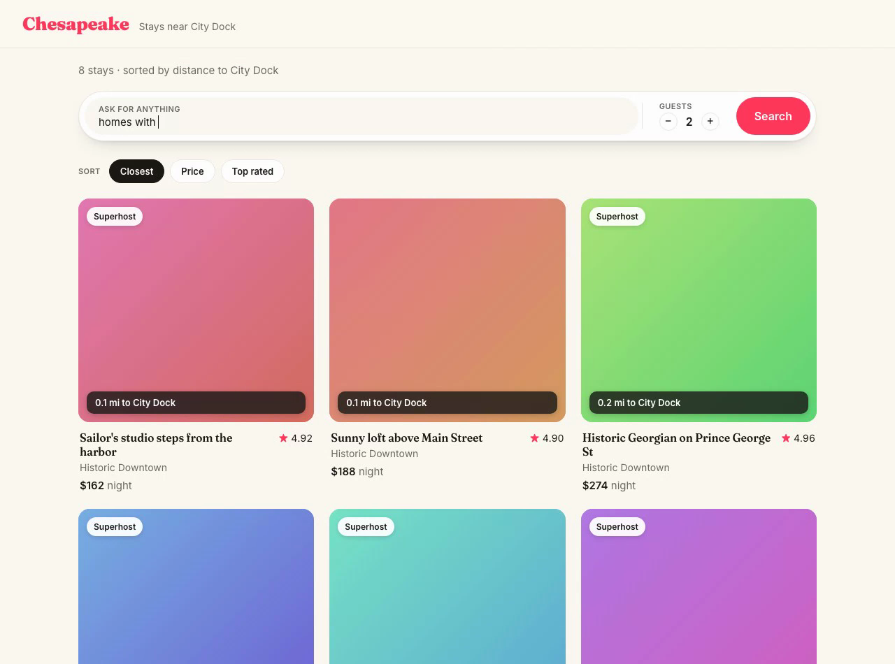
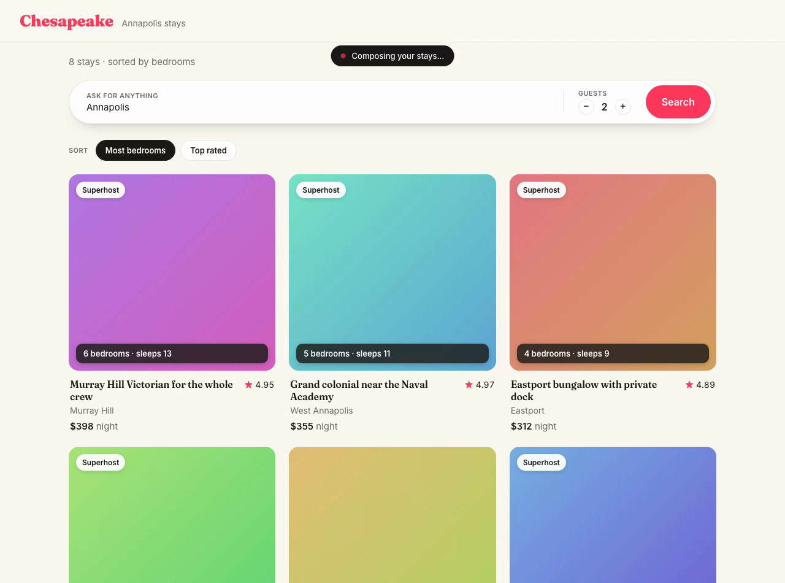
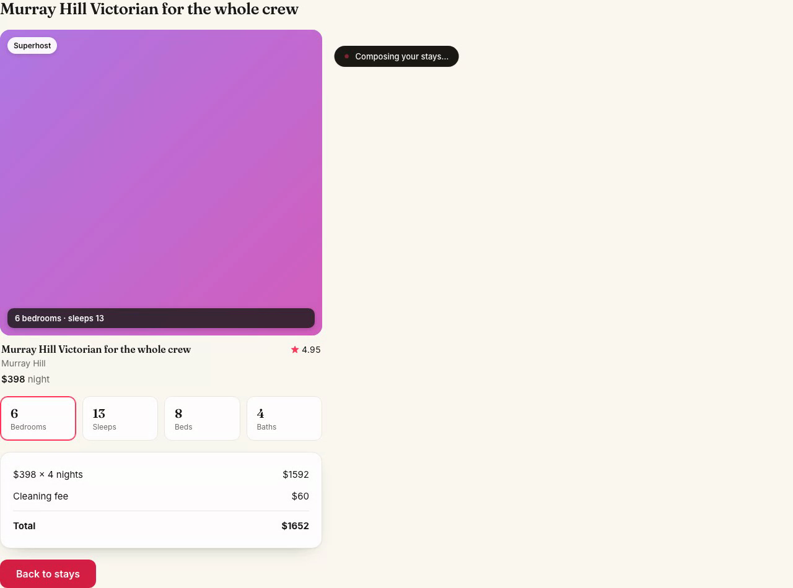

# Chesapeake — intent-adaptive generative UI, live

An Airbnb-style Annapolis stays app whose entire screen is **authored by an
agent** — and *reshapes itself to what you asked for*. Ask for "homes with the
most bedrooms" and every card leads with its bedroom count, sorted biggest
first. Ask for stays "near City Dock" and the cards lead with walking distance
and offer a sort-by-distance control. Same components, different emphasis — the
model decides.

You type a request; the model calls real tools, writes [OpenUI
Lang](../../specs/28-generative-ui.md), and your React components render it —
streaming in statement by statement.

It exercises the real generative-UI pipeline end to end against a live model:

- **`createLibrary` / `defineComponent`** — the component vocabulary the model may render.
- **`step.llm({ output: openUi(library) })`** — the streaming output codec; the model authors UI instead of prose.
- **`openUiSurface()`** — the server-authoritative memory layer that owns the mounted document across turns.
- **real tools** (`search_listings` with `near`/`sort` + haversine distance, `quote_price`) — the model infers the search intent, calls them, then bakes the results into components.

### Intent drives the layout

"Near City Dock" → distance featured on every card, sorted nearest-first:



"Homes with the most bedrooms" → the *same* cards now lead with bedroom counts, sorted biggest-first:



Open a stay and the detail's stat tiles lead with whatever you cared about (the `quote_price` tool feeds the `PriceBreakdown`):



A screen recording of the full flow — distance view → re-ask for "most
bedrooms" → open a stay → price + stats — is in
[`media/cais-demo.mp4`](./media/cais-demo.mp4).

## Run it

```bash
# 1. Server (the agent) — needs an OpenRouter key
OPENROUTER_API_KEY=sk-... bun run examples/openui-airbnb/server/server.ts

# 2. Client (Vite) — in another shell
cd examples/openui-airbnb/client
npm install
npm run dev            # http://localhost:5173  (proxies /agent → :8787)
```

Open http://localhost:5173. The search box is a **natural-language intent
field** — try "homes with the most bedrooms", "walkable to the Naval Academy",
or "cheapest waterfront" and watch the whole screen reshape. Click a stay for a
live price + stat detail, or use the sort chips to re-sort.

## Architecture

```
 browser (Vite/React)                    server (Bun)
 ─────────────────────                    ────────────
 App.tsx     ─ POST /agent {prompt} ───▶  harness.run(stays, prompt, ctx)
   │                                         │  step.llm + openUi(library) codec
   │  ◀── SSE: statement × N, done ──────    │  + openUiSurface() layer
 parseDocument()  (noetic's real parser)     │  + search_listings / quote_price tools
   │                                         ▼
 render.tsx ─▶ components.tsx            returns a UiDocument; statements streamed
```

The client owns **no** UI state — it parses the streamed OpenUI Lang with
noetic's own `parseDocument` (aliased straight to source in `vite.config.ts`)
and projects it through `components.tsx`. The agent decides emphasis by choosing
each `ListingCard.highlight`, the sort order, the `SortBar` options, and the
detail `StatGrid`. `Action([@ToAssistant(...)])` builtins become click handlers
that drive the next turn.

## Note on the transport

This demo drives turns with `harness.run` and streams the parsed statements to
the client (server-paced, so cards reveal one by one) rather than using
`@noetic-tools/openui/server`'s `serveOpenUi`.

`serveOpenUi` originally streamed **zero** statements against a live, tool-using
model — it terminated the SSE stream on the first SDK `response.completed` (the
tool round, before the render) and never surfaced the codec's statements. That
is **fixed** on branch `fix-openui-serve-streaming` (terminate on the framework
`turn_completed` event; flush the trailing `root` statement). Once that lands,
`server/server.ts` can be simplified to use the genuine `serveOpenUi` transport.
